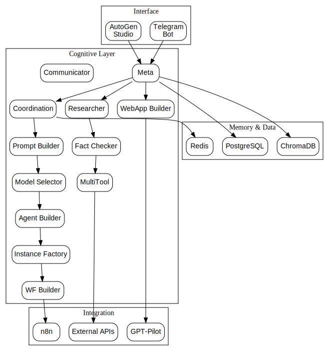

# Архитектура Root‑MAS

Этот документ описывает общую структуру многоагентной системы (MAS),
которая разворачивается в репозитории `root_mas`. Архитектура
разработана так, чтобы быть расширяемой, модульной и легко
интегрируемой с внешними сервисами (n8n, PostgreSQL, Redis, ChromaDB,
GPT‑Pilot, Telegram и др.).



## Слои архитектуры

```
┌────────────────  Interface ───────────────┐
│ Telegram Bot (STT/TTS) · AutoGen Studio   │
└───────────────▲───────────────▲───────────┘
                │               │
                │               │ logs/json
                │               │
     voice/text │               ▼
┌─────────────────────────────────────────────┐
│      COGNITIVE LAYER – Root GroupChat       │
│ Meta │ Coordination │ PromptBuilder │ …     │
└────────────────▲────────────────────────────┘
                 │tools / callbacks
                 ▼
┌─────────────────────────────────────────────┐
│      INTEGRATION LAYER                      │
│ n8n-Workflow-Builder │ MultiTool │ GPT-Pilot│
└────────────────▲────────────────────────────┘
                 │
                 ▼
┌─────────────────────────────────────────────┐
│      MEMORY & DATA                          │
│ Redis (cache) · Postgres (tasks) · Chroma    │
└─────────────────────────────────────────────┘
```

### Interface
На верхнем уровне располагается пользовательский интерфейс:
- **Telegram бот** с поддержкой преобразования речи в текст (STT) и обратно (TTS) через Yandex SpeechKit
- **RESTful API** сервер на порту 8080 для внешних интеграций
- **Интерактивная консоль** для прямого взаимодействия с системой
- **AutoGen Studio** для визуализации графа сообщений и анализа логов

### Cognitive Layer
Корневой GroupChat (Cognitive Layer) управляет взаимодействием
корневых агентов: `Meta`, `Coordination`, `Prompt‑Builder`,
`Model‑Selector`, `Agent‑Builder`, `Instance‑Factory`, `Researcher`,
`Fact‑Checker`, `MultiTool`, `WF‑Builder`, `WebApp‑Builder`, и
`Communicator`. Каждый агент имеет собственную роль, системный
промпт и память.

### Integration Layer
Интеграционный слой содержит инструменты, через которые MAS
взаимодействует с внешним миром: генерация workflow для n8n,
вызовы внешних API (MultiTool), интеграция с GPT‑Pilot для
создания web‑приложений. Здесь же подключаются callback‑функции
(`callbacks.py`) и их матрица (`callback_matrix.py`).

### Memory & Data
Для хранения и кэширования данных используются:

- **Redis** — временное хранилище (TTL) для статусов задач, временных токенов и cron‑таймеров.
- **PostgreSQL** — постоянное хранилище задач, сведений о развернутых инстансах и расписания cron‑заданий.
- **ChromaDB** — векторное хранилище для долговременной памяти и RAG (загрузка документов, поиск по ним).

## Корневые агенты

В `config/agents.yaml` определены все корневые агенты и их роли. Каждый
агент привязан к уровню модели LLM (cheap, standard, premium) и
собственной памяти. В папке `prompts/agents/*` для каждого агента
хранятся системные промпты.

Краткие роли агентов:

- **Meta** — оркестратор, следит за целями и распределяет задачи.
- **Coordination** — очередь задач и планировщик cron.
- **Prompt‑Builder** — управление и аудит системных промптов.
- **Model‑Selector** — выбор LLM с учётом стоимости и качества.
- **Agent‑Builder** — создание новых агентов на лету.
- **Instance‑Factory** — развёртывание MAS‑инстансов через Docker.
- **Researcher** — поиск информации и RAG.
- **Fact‑Checker** — проверка достоверности данных.
- **MultiTool** — единая точка доступа к внешним API.
- **WF‑Builder** — генерация и отправка n8n‑workflow.
- **WebApp‑Builder** — интеграция с GPT‑Pilot для web‑приложений.
- **Communicator** — взаимодействие с пользователем в Telegram.

## Каскад LLM
В файле `config/llm_tiers.yaml` определены уровни моделей и их
последовательность. Модуль `tools/llm_selector.py` реализует функции
`pick_config` (получить модель для текущего уровня) и
`retry_with_higher_tier` (повышение уровня при ошибке). Модуль
`budget_manager.py` отслеживает расход средств и сигнализирует о
необходимости понизить уровень модели.

## Callback‑матрица
Callback‑функции описаны в `tools/callbacks.py`, а матрица
соответствий событий и callback — в `tools/callback_matrix.py`. Они
обеспечивают обработку событий (создание инстансов, генерация
workflow, создание инструментов, отправка сообщений в Telegram и др.).

## Хранилища
Модули в пакете `memory/` предоставляют клиентские классы для работы с
Redis, PostgreSQL и ChromaDB. Их можно использовать для реализации
памяти агентов и общей глобальной памяти.

## Интеграция
Модули `tools/n8n_client.py`, `tools/wf_builder.py`, `tools/multitool.py`,
`tools/gpt_pilot.py`, `tools/webapp_builder.py`, `tools/researcher.py` и
`tools/fact_checker.py` служат для интеграции с n8n, внешними API,
GPT‑Pilot и веб‑поиском. Модуль `tools/modern_telegram_bot.py` содержит
пример бота для Telegram.

## Спринты
План работ делится на 14 спринтов, где каждый спринт расширяет
функциональность системы: от первоначальной версии до внедрения
наблюдаемости, безопасности и документации. Подробности см. в
`docs/sprints.md`.
